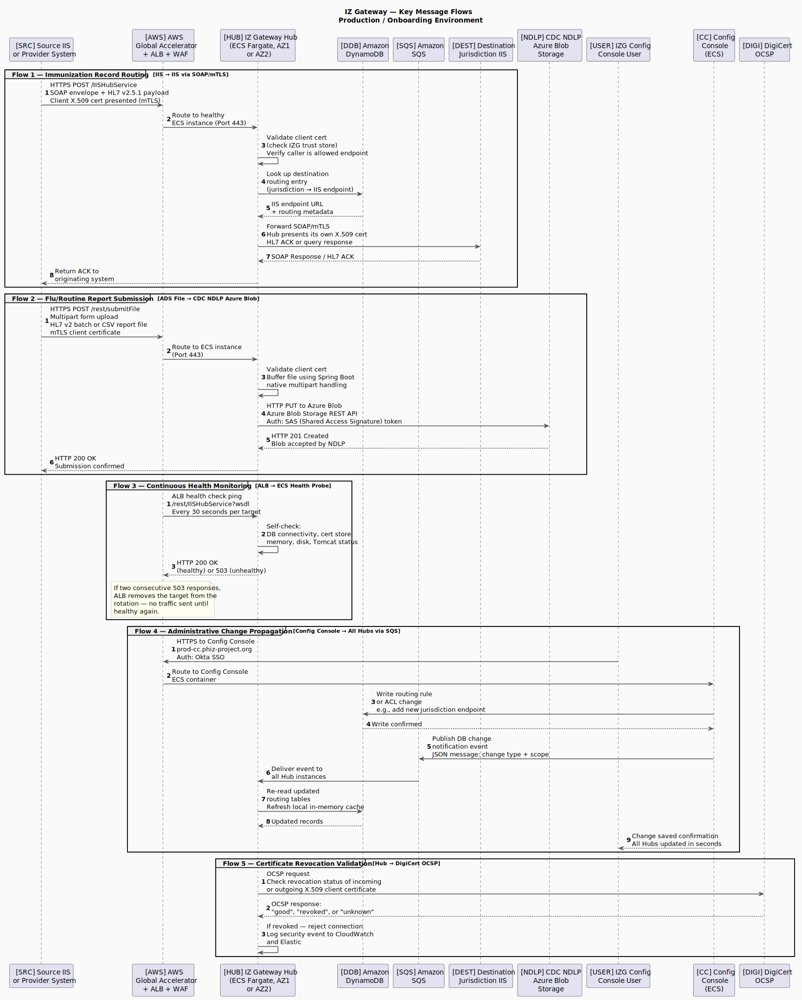

# IZ Gateway — Key Message Flows

## Introduction

This document describes the five primary communication flows that IZ Gateway handles in production. While the [system topology document](topology.md) shows all of the components and how they are connected, this document focuses on what actually happens step by step when a message moves through the system.

Each flow is shown as a sequence of numbered steps, with a diagram followed by a plain-language description of what is happening at each step and why. The intended audience is a senior manager who needs to understand IZ Gateway's capabilities and behaviors without requiring a technical background in cloud infrastructure, networking, or software development.

**Participants in the diagrams** are labeled with short labels **[SRC]**, **[AWS]**, **[HUB]**, etc. for easy cross-reference with the descriptions below.

---

## Diagram

[View PlantUML source](interactions.puml)

---

## Participants

The following systems appear in the flows. Numbers correspond to the labels in the diagram.

| # | Participant | Role |
|---|-------------|------|
| **[SRC]** | Source IIS or Provider System | The sending organization — a state immunization registry, provider EHR system, or patient-facing app that is submitting data or requesting records. |
| **[AWS]** | AWS Global Accelerator + ALB + WAF | The entry infrastructure: Global Accelerator receives the connection and routes it to the appropriate AWS region; the Application Load Balancer distributes it to an available Hub; the Web Application Firewall inspects and filters the request before it reaches the Hub. |
| **[HUB]** | IZ Gateway Hub | The core routing application, running as a containerized service. The Hub authenticates callers, routes messages, and enforces access control. At any given moment, multiple Hub instances may be running across two AWS Availability Zones. |
| **[DDB]** | Amazon DynamoDB | The database that stores all routing rules, access control lists, and configuration. The Hub queries this database to determine where messages should be sent. |
| **[SQS]** | Amazon SQS | A message queue used to notify all Hub instances when routing data has changed, so that every Hub immediately picks up the latest configuration. |
| **[DEST]** | Destination Jurisdiction IIS | The immunization information system of the receiving jurisdiction — the final destination for a routed immunization record. |
| **[NDLP]** | CDC NDLP — Azure Blob Storage | The CDC's National Data Lakehouse Program storage container, hosted on Microsoft Azure, where IZ Gateway deposits flu and routine immunization report files on behalf of submitting jurisdictions. |
| **[USER]** | IZG Config Console User | An authorized administrative user — typically APHL or jurisdiction staff — who makes routing and onboarding changes through the Configuration Console. Access control settings are maintained by Audacious Inquiry support staff. |
| **[CC]** | Config Console (ECS) | The web application that provides the administrative interface for managing IZ Gateway's routing rules and onboarding settings. Access control settings are maintained separately by Audacious Inquiry support staff. |
| **[DIGI]** | DigiCert OCSP | DigiCert's certificate status service. IZ Gateway queries this service to verify that the digital certificates being used by connecting systems have not been revoked. |

---

## Flow Descriptions

---

### Flow 1 — Routing an Immunization Record (IIS to IIS)

**What it does:** Moves an immunization record from a source jurisdiction's system to a destination jurisdiction's system through IZ Gateway.

This is the core function of IZ Gateway — acting as a trusted intermediary that routes immunization messages between systems that may not have direct connections with each other.

| Step | What Is Happening |
|------|-------------------|
| **1** | The source IIS sends a message to IZ Gateway over a secure, encrypted connection (HTTPS). The message uses a standard healthcare messaging format called HL7 v2.5.1 and is wrapped in a SOAP envelope — a widely used protocol for web service communication. Along with the message, the source system presents its own digital identity certificate, which IZ Gateway uses to verify who is calling. This two-way certificate exchange is called mutual TLS (mTLS). |
| **2** | The Global Accelerator and ALB receive the connection, apply security filtering, and forward the request to one of the available Hub containers. The load balancer selects the Hub — the calling system does not need to know which one it will reach. |
| **3** | The Hub validates the caller's certificate: it checks that the certificate is in IZ Gateway's list of trusted partners and that the caller is authorized to send messages to the requested destination. If either check fails, the connection is rejected here and no message is routed. |
| **4–5** | The Hub queries the DynamoDB routing table to look up the endpoint address for the destination jurisdiction. The database returns the IIS URL and any associated routing metadata. |
| **6–7** | The Hub opens its own secure, mutually authenticated connection to the destination IIS and delivers the message. In this outbound connection, the Hub presents *its own* certificate as proof of identity. The destination IIS responds with an acknowledgment (ACK) confirming that the message was received. |
| **8** | The Hub returns the acknowledgment to the original sending system, completing the end-to-end exchange. |

---

### Flow 2 — Submitting a Report to the CDC

**What it does:** Delivers flu or routine immunization report files from a jurisdiction to the CDC's National Data Lakehouse Program (NDLP) storage.

This flow is distinct from record routing. Instead of forwarding a single immunization message, the jurisdiction submits a batch report file. IZ Gateway receives the file and uploads it to a CDC-operated cloud storage location on Microsoft Azure.

| Step | What Is Happening |
|------|-------------------|
| **1** | The source system sends a file upload request to IZ Gateway's file submission endpoint (`/rest/submitFile`). The request includes the report file and the sender's digital certificate for authentication. |
| **2** | Global Accelerator and ALB route the connection to a Hub container. |
| **3** | The Hub validates the caller's certificate and accepts the incoming file. Spring Boot (the application framework used by the Hub) handles the file transfer natively, temporarily holding the file in memory or on disk as it is received from the sender. |
| **4** | The Hub connects to the CDC NDLP Azure Blob Storage container and writes (uploads) the file using the Azure Blob Storage REST API — essentially a standard web file transfer. Access to the NDLP storage container is granted through a SAS (Shared Access Signature) token, which is a time-limited credential that authorizes writes to a specific location in Azure storage. |
| **5** | Azure Blob Storage confirms that the file was received and stored successfully (HTTP 201 Created). |
| **6** | The Hub returns a success confirmation to the originating jurisdiction system. |

---

### Flow 3 — Continuous Health Monitoring

**What it does:** Automatically detects when a Hub container is not functioning correctly and removes it from service until it recovers.

IZ Gateway runs with multiple Hub instances at all times. The load balancer continuously checks that each Hub is healthy so that unhealthy instances are not sent real traffic.

| Step | What Is Happening |
|------|-------------------|
| **1** | Every 30 seconds, the ALB sends a simple HTTP health check request to each Hub instance. This is an automated probe — no human action is involved. |
| **2** | The Hub performs a quick internal self-assessment: it checks that it can reach the DynamoDB database, that its certificate store is accessible, and that its key operational processes are running normally. |
| **3** | The Hub responds with either "healthy" (HTTP 200) or "not healthy" (HTTP 503). If the ALB receives two consecutive unhealthy responses, it automatically stops sending real traffic to that instance. Traffic continues flowing normally through the remaining healthy instances. Once the unhealthy Hub recovers and passes health checks again, the load balancer resumes sending it traffic. |

---

### Flow 4 — Propagating an Administrative Change

**What it does:** Ensures that when a routing rule, participant configuration, or access control setting is changed in the Configuration Console, every running Hub instance picks up that change immediately.

Because IZ Gateway runs multiple Hub instances in parallel (across two AWS regions and two Availability Zones), a simple database update is not enough — each Hub maintains a local copy of routing data in memory for performance. This flow shows how the system keeps all of those copies synchronized.

| Step | What Is Happening |
|------|-------------------|
| **1** | An authorized administrative user logs in to the Configuration Console through a web browser. The login is authenticated via Okta, a single sign-on service that ensures only authorized personnel can access the console. |
| **2** | The user's browser connection is routed through Global Accelerator and the ALB to the Config Console application container. |
| **3–4** | The user makes a change — for example, adding a new jurisdiction endpoint or updating an access control rule. The Config Console writes the change directly to DynamoDB. DynamoDB confirms the write. |
| **5** | The Config Console publishes a notification message to Amazon SQS, describing what changed. |
| **6** | Every running Hub instance receives that notification from SQS. Each Hub then queries DynamoDB to read the updated records and refreshes its local routing cache. This happens within seconds of the original database write. |
| **7–8** | Each Hub reads the updated data from DynamoDB and applies it. |
| **9** | The Config Console confirms to the user that the change was saved. In practice, all Hub instances will have the updated configuration within a few seconds of this confirmation. |

---

### Flow 5 — Certificate Revocation Validation

**What it does:** Verifies in real time that a digital certificate being used to connect to IZ Gateway has not been revoked by its issuing authority.

Digital certificates are the electronic credentials that IZ Gateway uses to verify the identity of connecting systems (and vice versa). A certificate can be revoked before its expiration date if, for example, the private key is believed to have been compromised. IZ Gateway checks certificate validity with DigiCert, the certificate authority that issues production certificates.

| Step | What Is Happening |
|------|-------------------|
| **1** | The Hub sends an OCSP (Online Certificate Status Protocol) request to DigiCert's certificate status service. OCSP is the standard internet protocol for checking whether a specific certificate is currently valid or has been revoked. |
| **2** | DigiCert responds with one of three statuses: **good** (the certificate is valid), **revoked** (the certificate has been invalidated and should not be trusted), or **unknown** (DigiCert does not have information about this certificate). |
| **3** | If the certificate status is "revoked," the Hub immediately closes the connection and refuses to process the request. The security event is logged to both CloudWatch (for operational alerting) and Elastic.co (for audit and investigation). If the certificate is "good," the connection proceeds normally. |

---

*Document generated from `interactions.puml`. For the latest version of the diagram source, see that file.*
