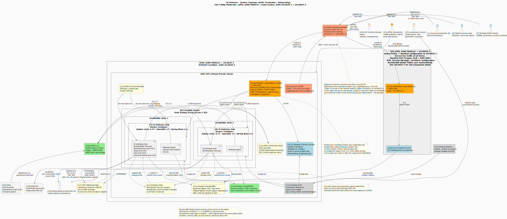

# IZ Gateway — System Topology

## Introduction

This document describes the system topology of **IZ Gateway (IZG)** — the national hub infrastructure that enables immunization data to flow securely between healthcare providers, state and local immunization information systems (IIS), and federal reporting destinations such as the CDC National Data Lakehouse Program (NDLP).

IZ Gateway is hosted on the **APHL AIMS Platform**, a federally authorized cloud environment operated by the American Public Health Laboratories (APHL) on Amazon Web Services (AWS). The system is classified at the FISMA Moderate security level.

The diagram below shows the full production topology: every organization and system that connects to IZ Gateway, the core platform components that run it, and the services that keep it secure and observable.

---

## Diagram

[View PlantUML source](topology.puml)

---

## Component Descriptions

The components are numbered in the diagram for easy reference. What follows is a plain-language description of each, grouped by role.

---

### Who Sends Data to IZ Gateway

| # | Component | Description |
|---|-----------|-------------|
| **[1]** | **Source Jurisdiction IIS** | The immunization information systems operated by each of the 64 U.S. jurisdictions (50 states plus territories and cities). These are the primary senders of immunization records. They connect to IZ Gateway over a secure, mutually authenticated connection. |
| **[2]** | **Provider EHR System** | Electronic health record systems used by healthcare providers — for example, pharmacy chains, vaccination clinic software (VAMS), or multi-jurisdiction providers — that submit immunization records directly to IZ Gateway. |
| **[3]** | **Patient Access App** | Consumer-facing mobile or web applications (such as Docket) that allow patients to retrieve their own immunization records through IZ Gateway. |

---

### How Traffic Enters IZ Gateway

| # | Component | Description |
|---|-----------|-------------|
| **[4]** | **AWS Global Accelerator** | The single point of entry for all traffic into IZ Gateway. Global Accelerator provides two stable IP addresses that never change, regardless of which AWS region is serving traffic. This is the technology that enables IZ Gateway to be active in two AWS regions simultaneously — both serve live traffic at all times. If one region becomes unavailable, Global Accelerator detects the failure and the remaining active region absorbs all load within approximately 30 seconds, with no action required by sending systems. |
| **[5]** | **Route 53 / ACM** | AWS's DNS service (Route 53) translates human-readable addresses like `izgateway.org` into the Global Accelerator IP addresses. ACM (AWS Certificate Manager) provides and automatically renews the TLS certificates used to secure these public-facing addresses. |

---

### The APHL AIMS Platform — US-EAST-1

The US-EAST-1 processing region is hosted in the AWS US-EAST-1 data center, within a secure, isolated network environment called a Virtual Private Cloud (VPC).

| # | Component | Description |
|---|-----------|-------------|
| **[6]** | **Application Load Balancer (ALB) + AWS WAF** | The first line of defense inside the AWS environment. The ALB receives all inbound connections and distributes them across the active Hub containers. Attached to the ALB is the AWS Web Application Firewall (WAF), which inspects every request and can block connections from known malicious sources, enforce rate limits to prevent abuse, and apply AWS-managed security rule sets. All connections must use TLS 1.2 or higher with FIPS-compliant encryption. |
| **[7]** | **IZ Gateway Hub — Availability Zone 1** | One of the Hub application containers running in US-EAST-1. The Hub is the core routing engine of IZ Gateway: it authenticates incoming connections using digital certificates, looks up where the message should go, and forwards it securely to the correct destination IIS. Each Hub also includes a log-shipping agent (Filebeat) that forwards operational logs to Elastic.co for monitoring. |
| **[8]** | **IZ Gateway Hub — Availability Zone 2** | An identical Hub container running in a separate AWS data hall (Availability Zone). Having two Hubs in separate physical locations means that if one data hall experiences a hardware or power problem, the other continues to serve traffic without interruption. The ALB automatically stops sending traffic to any Hub that becomes unresponsive. |
| **[9]** | **IZ Gateway Configuration Console** | A secure web application used to manage IZ Gateway's routing rules, onboarding of new jurisdictions, and access control settings. Routing and onboarding changes are made by authorized administrative users; access control settings are maintained by Audacious Inquiry support staff. Changes made here are applied to all Hub instances automatically (see **[11] SQS** below). Access requires authentication through Okta. |
| **[10]** | **Amazon DynamoDB** | The database that stores IZ Gateway's routing tables, access control rules, and certificate references. DynamoDB is a fully managed, highly available NoSQL database. It is configured as a **Global Table**, which means it automatically and continuously replicates data between US-EAST-1 and US-WEST-2 — so both regions always have the same routing information. Data is encrypted at rest using AES-256. |
| **[11]** | **Amazon SQS** | A messaging queue service that ensures all Hub instances are kept up to date when routing data changes. When an administrator saves a change in the Configuration Console, a notification is published to SQS. Every running Hub instance receives that notification and immediately refreshes its local copy of the routing tables from DynamoDB. This fan-out approach ensures consistency across all containers without requiring them to constantly poll the database. |
| **[12]** | **Amazon ECR** | The private container registry where packaged versions of the IZ Gateway Hub and Configuration Console software are stored as Docker images. When a new software version is released, the updated image is pushed here. ECS Fargate pulls the new image from ECR when deploying an update. |
| **[13]** | **Amazon CloudWatch** | AWS's built-in monitoring and alerting service. CloudWatch collects operational metrics — such as CPU usage, memory consumption, and disk utilization — from every Hub container. ECS uses CloudWatch health check results to determine whether a container is healthy and whether additional containers need to be started (auto-scaling). |
| **[14]** | **AWS Secrets Manager** | A secure vault for sensitive configuration values such as API keys, passwords, and the API key used to authenticate with Elastic.co. Rather than storing these values in application code or configuration files, the Hub retrieves them securely from Secrets Manager at startup. |
| **[15]** | **AWS Certificate Store (EFS-backed)** | Stores the X.509 digital certificates and cryptographic keystores used by IZ Gateway for mutual TLS authentication. These include IZ Gateway's own certificate (which it presents when connecting to destination IIS endpoints) and the trust store of all partner certificates it is authorized to accept. Backed by Amazon EFS (Elastic File System) for shared access across all Hub containers. |

---

### High Availability — US-WEST-2

| # | Component | Description |
|---|-----------|-------------|
| **[25]** | **APHL AIMS Platform — US-WEST-2** | A fully active, independent deployment of IZ Gateway running in an AWS data center on the west coast of the United States. It runs the same Hub containers **[25b]** behind the same ALB + WAF configuration **[25a]** and serves live traffic at all times — it is not a standby or backup. Because DynamoDB Global Tables **[10]** automatically synchronize data between regions, the US-WEST-2 environment always has current routing information. The Global Accelerator **[4]** routes traffic to both regions simultaneously. If one region becomes unavailable, Global Accelerator detects the failure and the remaining active region absorbs all load within approximately 30 seconds, with no action required by connected systems. |

---

### Where Messages Go

| # | Component | Description |
|---|-----------|-------------|
| **[16]** | **Destination Jurisdiction IIS** | The immunization information systems of the receiving jurisdictions. When a Hub routes an immunization record, it establishes its own secure, mutually authenticated connection to the destination IIS and delivers the message on behalf of the sender. |
| **[17]** | **CDC National Data Lakehouse Program (NDLP)** | A CDC-operated data repository hosted on Microsoft Azure. Flu and routine immunization report files submitted to IZ Gateway are forwarded here by the Hub. The connection uses the Azure Blob Storage REST API, and access is granted through a SAS (Shared Access Signature) token — a time-limited credential that authorizes write access to a specific storage container. |

---

### Supporting External Services

| # | Component | Description |
|---|-----------|-------------|
| **[18]** | **Elastic.co** | A cloud-hosted Elasticsearch service that stores operational and audit logs from all Hub containers. The Filebeat agents embedded in each Hub container ship logs to Elastic.co in near-real time. Operations staff use Elastic's Kibana dashboard to search logs, investigate issues, and review security events. Elastic.co has signed a HIPAA Business Associate Agreement (BAA) with Audacious Inquiry for this service. |
| **[19]** | **DigiCert Certificate Authority** | The commercial certificate authority that issues IZ Gateway's production X.509 certificates. DigiCert also provides the OCSP (Online Certificate Status Protocol) service that IZ Gateway uses to verify in real time whether an incoming certificate has been revoked — a security check that happens once every 24 hours per certificate. |
| **[20]** | **Okta SSO Provider** | An identity service used to authenticate operational staff when they log in to the Elastic.co dashboard. Rather than managing separate usernames and passwords for Elastic, staff authenticate through their organization's single sign-on (SSO) account via Okta. |

---

### Who Manages and Operates IZ Gateway

| # | Component | Description |
|---|-----------|-------------|
| **[21]** | **APHL Operations** | The APHL team responsible for managing the AIMS platform infrastructure — including deploying software, administering the production database, and managing the AWS environment. APHL has full administrative access to the production VPC. |
| **[22]** | **Audacious Inquiry** | The software development organization that owns and maintains the IZ Gateway codebase. Audacious Inquiry developers build and test new versions of the Hub and Configuration Console software, then publish them to ECR via GitHub Actions. Support staff also maintain access control settings in the Configuration Console and provide operational support when needed. |
| **[23]** | **IZG Config Console Users** | Administrative users — typically public health informatics staff from APHL and participating jurisdictions — who use the Configuration Console to onboard new participants and manage routing rules. |
| **[24]** | **GitHub Actions** | The automated build and deployment pipeline. When a developer merges approved code into a release branch, GitHub Actions builds the software, runs automated tests, packages it as a Docker image, and pushes it to Amazon ECR **[12]**. This automation ensures a consistent, auditable process for every software release. |

---

*Document generated from `topology.puml`. For the latest version of the diagram source, see that file.*
